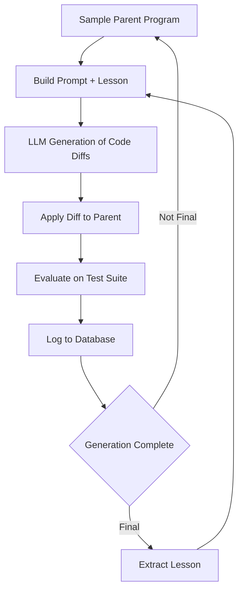

# Cadence: Program Evolution via Large Language Models

# Badges
[](https://github.com/yash-srivastava19/cadence/actions)
[](https://yash-srivastava19.github.io/cadence)
[](LICENSE)

Cadence implements an evolutionary system that uses large language models (LLMs) to iteratively generate, mutate, and improve programs for solving computational problems. The current implementation focuses on optimizing solutions to the Traveling Salesman Problem (TSP).

## Architecture



The system evolves programs over generations using the following loop:

1. Sample a parent program and its previously generated children.
2. Construct a prompt that includes the parent, children, and instructions.
3. Use an LLM to generate modified versions of marked code blocks.
4. Apply the generated diffs to produce a child program.
5. Evaluate the child program's performance on a fixed test suite.
6. Log and store the program and its performance in a database.
7. Periodically promote the best-performing program to guide future generations.
8. Optionally mutate the instructions used in prompts to encourage better code.

## Key Features

* TSP solution evolution using only standard Python (no external math libraries)
* Multi-seed deterministic evaluation for stable cost metrics
* SQLite-backed storage of program generations and performance
* Parallel evaluation for faster feedback
* Meta-prompting: periodically updates instructions to steer LLM behavior
* Modular task abstraction to support other optimization problems in the future

## Table of Contents
- [Architecture](#architecture)
- [Key Features](#key-features)
- [Getting Started](#getting-started)
- [Configuration](#configuration)
- [Usage](#usage)
- [Directory Structure](#directory-structure)
- [Citation](#citation)
- [Contributing](#contributing)
- [License](#license)

## Getting Started

### Quickstart

Run the out-of-the-box examples:

```bash
# Hypothesis 1: Cost evolution
python run_h1_experiment.py --config_name h1_config

# Hypothesis 2: Scaling analysis
python run_h2_experiment.py --config_name h2_config
```

Results (`h1_results.png`, `h2_scaling_analysis.png`) and JSON summaries will appear in the project root.

### Requirements & Installation

1. Clone the repo and enter directory:
   ```bash
   git clone https://github.com/yash-srivastava19/cadence.git
   cd cadence
   ```
2. Create and activate a virtual environment:
   ```bash
   python -m venv .venv
   .venv/bin/Activate
   ```

3. Install dependencies (using `uv` for reproducible installs):
   ```bash
    uv sync
   ```

## Configuration with Hydra

All experiment scripts leverage [Hydra](https://hydra.cc/) for flexible, YAML-driven configuration. Sample `conf/h1_config.yaml`:

```yaml
SEEDS: 10
GENERATIONS: 20
LESSON_INTERVAL: 4
API_MAX_RETRIES: 3
API_TIMEOUT: 60
hydra:
  run:
    dir: .                     # write outputs to project root
  output:
    subdir: null               # disable timestamped folders
```

Override on the command line without editing YAML:

```bash
# Change number of seeds and interval at runtime
git checkout main
python run_h1_experiment.py SEEDS=5 LESSON_INTERVAL=2
```

## Usage Examples

### Evolve a TSP Solver in Python

```python
from src.tasks.tsp_task import TSPTask
from src.prompt_sampler import build
from src.llm import generate
from src.evolve import apply_diff

# Initialize problem with 10 cities
task = TSPTask(n_cities=10)
base_code = task.baseline_program
# Build a prompt without lessons
prompt = build((None, None, None, base_code, None), [], None)
# Call LLM to get diff
diffs = generate(prompt)
# Apply diff to generate a new child solution
child_code = apply_diff(base_code, diffs)

print("Baseline code:\n", base_code)
print("Evolved code:\n", child_code)
```

### Extracting Lessons Programmatically

```python
from src.meta_prompting import get_lesson_from_history
# Assume 'logs' is a list of experiment entries with 'generation' and 'cost'
lesson = get_lesson_from_history(logs, previous_lesson=None)
print("Heuristic lesson:", lesson)
```

### Web Interface

Cadence provides a built-in Flask-based UI for live monitoring of experiments. Launch it with:
```bash
python ui/launch_ui.py
```
Then open your browser at http://localhost:5000 to explore real-time metrics, cost evolution plots, and logs.


## Directory Structure

```text
cadence/
├── conf/                      # Hydra configuration files
│   ├── h1_config.yaml
│   └── h2_config.yaml
├── src/                       # Core library modules
│   ├── database.py
│   ├── evaluator.py
│   ├── evolve.py
│   ├── llm.py
│   ├── prompt_sampler.py
│   └── tasks/                 # Problem definitions (TSP, etc.)
└── run_h1_experiment.py      # Hypothesis 1 script
    run_h2_experiment.py      # Hypothesis 2 script
```


## Notes

* All code blocks must be marked with `### START_BLOCK` and `### END_BLOCK`.
* Prompts are built to explicitly instruct the LLM to only change marked blocks.
* Evaluation is deterministic using seeded inputs.
* The project uses `uv` for reproducible dependency management and performance.

## Extending

To make cadence work for problems beyond TSP, you can define your own custom tasks by implementing the `Task` interface. This makes the system problem-agnostic while keeping the core workflow intact.

### Step 1: Create a New Task File

Create a new Python file in `src/tasks/`, for example:

```bash
touch src/tasks/knapsack_task.py
```

### Step 2: Implement the Task Interface

Each task must subclass `Task` and implement the following:

```python
from src.task import Task

class YourTask(Task):
    @property
    def function_name(self):
        # Name of the function LLM is expected to generate
        return "solve"

    def generate_inputs(self, seed: int):
        # Generate deterministic input using the seed
        return ...

    def evaluate(self, output, input_data) -> float:
        # Return a numerical metric (lower is better)
        return ...
```

* `function_name`: This must match the name of the function the LLM is expected to define.
* `generate_inputs(seed)`: Generate problem input. This can be a list, tuple, or dict.
* `evaluate(output, input_data)`: Accepts output from the evolved program and returns a numeric cost.

### Step 3: Use the Task in `main.py`

Import your task class and instantiate it:

```python
from tasks.knapsack_task import KnapsackTask
task = KnapsackTask()
```

Then pass it into the `execute()` function:

```python
metric = execute(child_program_code, task)
```

### Tips

* Use only standard Python libraries (`math`, `itertools`, `re`, etc.).
* Keep test inputs deterministic via seeds.
* Define a cost metric that is meaningful, consistent, and scalar.
* Try to avoid relying on `random` inside the generated programs themselves.


## License

This project is licensed under the MIT License.

## Citation

If you use Cadence in your research or projects, please cite:
```bibtex
@software{cadence2025,
  author = {Yash Srivastava},
  title = {{Cadence: Program Evolution via Large Language Models}},
  year = {2025},
  url = {https://github.com/yash-srivastava19/cadence},
  version = {main}
}
```

---
