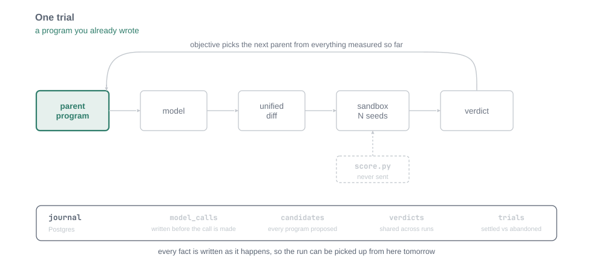
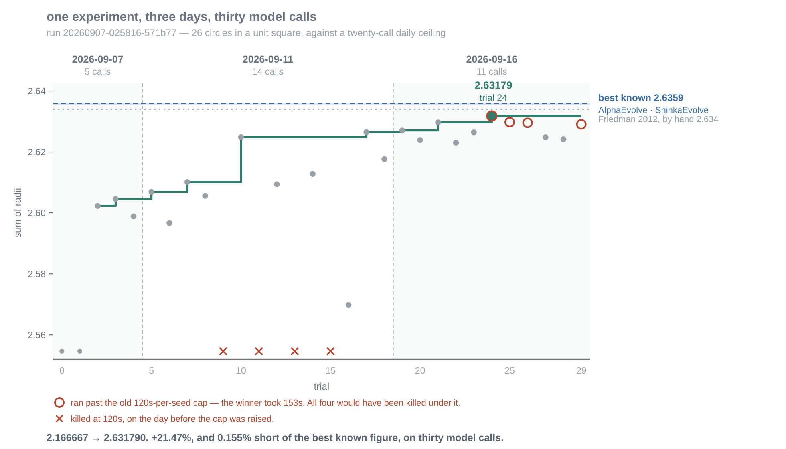

# Experiments and evidence

Cadence is built to make experiments inspectable, including the runs that expose a flawed baseline, misleading metric, or incomplete recovery story.

## Published work

- [The Harness Was the Experiment](https://yash-sri.xyz/blog/evolving_problems_cadence) describes circle packing, bin packing, Lean, and job-shop scheduling runs.
- [Cadence: Evolving Code with LLMs for NP-Hard Problems](https://yash-sri.xyz/blog/cadence_blog) explains the earlier TSP system and its evolutionary loop.

These are not marketing screenshots. They are useful because they show the system under pressure: a trial being stepped through, a run continuing across days, and candidates changing while the measurement remains outside the editable region.

<figure markdown>
  { loading=lazy }
  <figcaption>One trial, stepped through. The scoring command remains outside the region the model can rewrite.</figcaption>
</figure>

<figure markdown>
  { loading=lazy }
  <figcaption>A run can cross day boundaries because the measured history is durable.</figcaption>
</figure>

## Lessons the docs should preserve

- The scoring harness is part of the experiment.
- A baseline should be measured by the same machinery as a candidate.
- Validation improvements can fail to generalize to held-out data.
- A model can only use the information exposed in the prompt and program.
- Small budgets make replay, resumability, and honest failure handling valuable.
- A winner is an artifact to inspect and reproduce, not a claim detached from its measurement conditions.

These pages are evidence and explanation, not promises about what every Cadence run will achieve.
